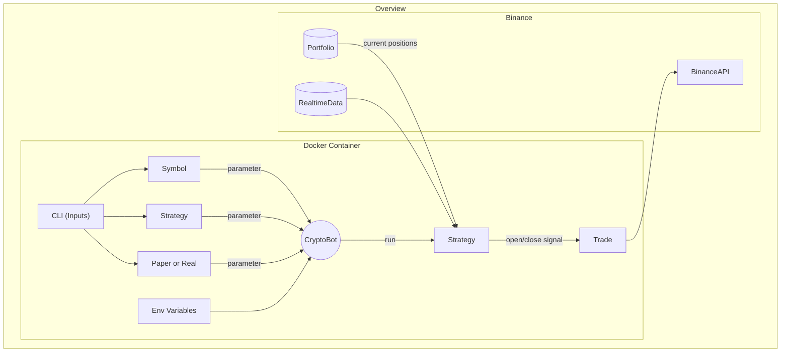

# Algorithmic Trading
This is the start of a project where we make a bot that will automatically buy and sell crypto for us. 

---

For updating requirements.txt, use:
```
pip install pipreqs
pipreqs . --force --ignore **/Archive
```
More info: https://github.com/bndr/pipreqs

---

Below is a flowchart for describing the *(desired)* structure of the program.

Uses Mermaid Markdown https://mermaid.live/

