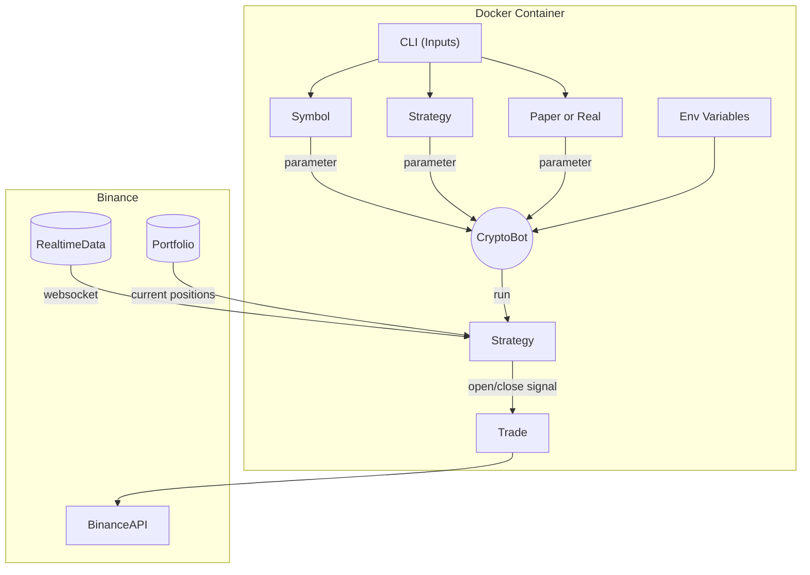

# Algorithmic Trading
## Welcome to the money printer.
This is the start of a project where we make a bot that will automattically buy and sell crypto for us. 

```mermaid
    flowchart TD
        subgraph Docker Container 
        direction TB
        Env[Env Variables]
        
        CLI["CLI (Inputs)"] --> Symbol[Symbol]
        CLI --> InputStrat[Strategy]
        CLI --> Type[Paper or Real]

        Symbol -- parameter --> CryptoBot((CryptoBot))
        InputStrat -- parameter --> CryptoBot
        Type -- parameter --> CryptoBot
        Env --> CryptoBot

        CryptoBot -- run --> Strategy
        Strategy -- open/close signal --> Trade

        end
        subgraph Binance
            RealtimeData[(RealtimeData)] -- websocket --> Strategy
            Portfolio[(Portfolio)] -- current positions --> Strategy
            BinanceAPI
        end
            Trade --> BinanceAPI
```